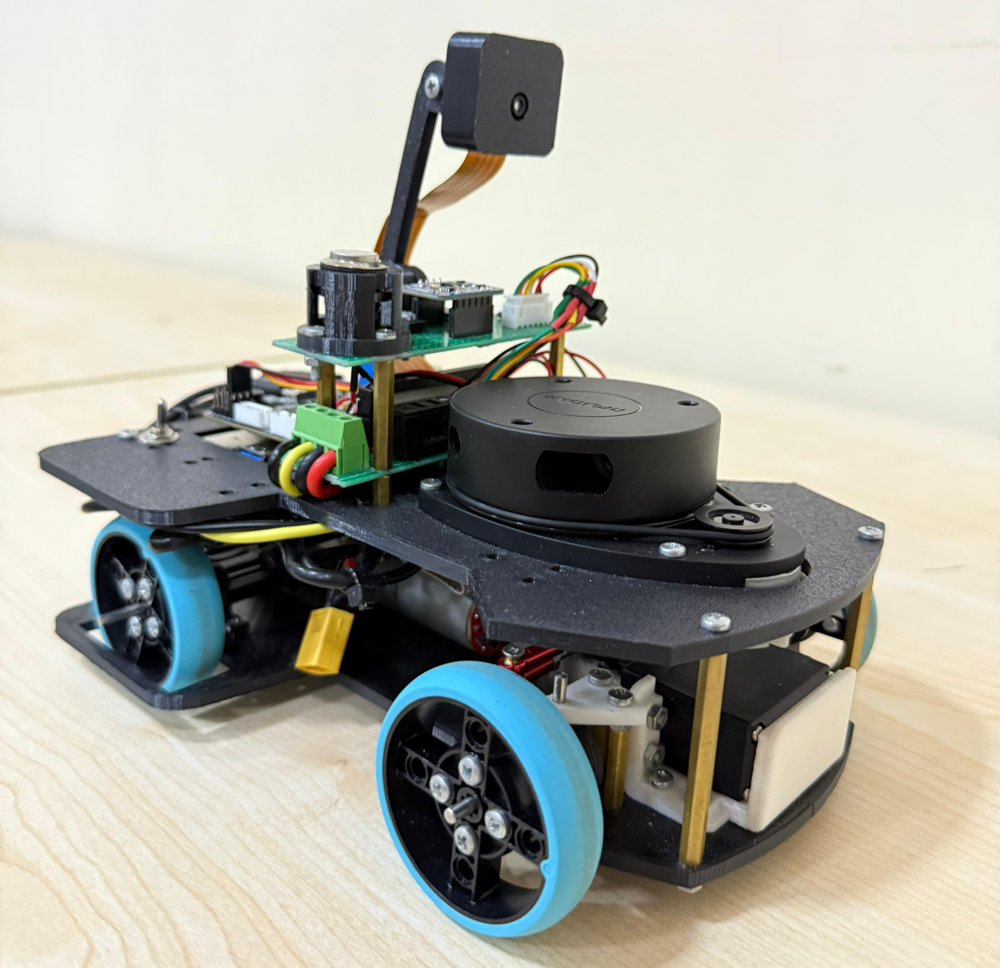
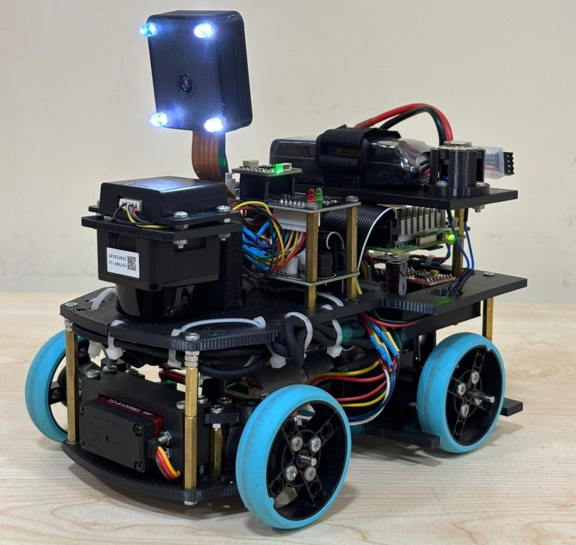

<table align="center" cellspacing="0" cellpadding="0" style="margin:0; padding:0; border-collapse:collapse;">
  <tr>
    <th colspan="3">Evolution Table</th>
  </tr>
  <tr>
    <td><h3><b>Specifications</b></h3></td>
    <td align="center" style="margin:0; padding:0;"></td>
    <td align="center"></td>
  </tr>
  <tr>
    <td>Controller</td>
    <td>Raspberry Pi 5, 8 GB RAM</td>
    <td>Raspberry Pi 5, 8 GB RAM</td>
  </tr>
    <tr>
    <td>Camera</td>
    <td>Raspberry Pi Camera Module 3</td>
    <td>Raspberry Pi Camera Module 3</td>
  </tr>
    <tr>
    <td>Lidar</td>
    <td>RPLidar A1M8</td>
    <td>Yahboom T-MINI-PLUS</td>
  </tr>
    <tr>
    <td>IMU</td>
    <td>BNO055</td>
    <td>BNO085</td>
  </tr>
    <tr>
    <td>Servo Motor</td>
    <td>MG995 (Analog)</td>
    <td>TD8120MG (Digital)</td>
  </tr>
    <tr>
    <td>Boards</td>
    <td>Prefboard</td>
    <td>PCB</td>
  </tr>
    <tr>
    <td>Ackermann Geometry</td>
    <td>Not exactly (some minor issues)</td>
    <td>Yes (fixed those issues)</td>
  </tr>
    <tr>
    <td>Motor Driver</td>
    <td>DRV8833</td>
    <td>TB6612FNG</td>
  </tr>
    <tr>
    <td>Motor Drive Controller</td>
    <td>Raspberry Pi Pico 2</td>
    <td>Raspberry Pi Pico W</td>
  </tr>
</table>