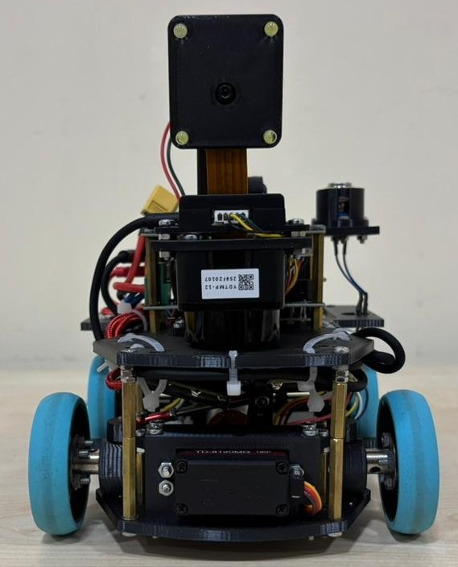

<h1>AZE - 44 Team Report</h1>

<table cellspacing="0" cellpadding="0" style="margin:0; padding:0; border-collapse:collapse;">
  <tr>
    <th colspan="2">Team Photos</th>
  </tr>
  <tr>
    <td align="center" style="margin:0; padding:0;"> <b>Funny Photo</b></td>
    <td align="center"> <b>Official Photo</b></td>
  </tr>
</table>

Our team consists of 3 members: Eyyub Şenal (center in the official photo), Əhməd Qəmbərli (rightmost in the official photo), and Melisa Yıldız (leftmost in the official photo). Everyone in this team has an experience of WRO at least at national level. Eyyub and Melisa have even participated at international stages. Eyyub received a silver medal in WRO 2023 Panama and Melisa received a gold medal in WRO 2024 İzmir. Here are communication informations for our team:

- Eyyub Şenal from [Bakı Türk Anadolu Liseyi](https://btal.meb.k12.tr/):
  - <a href="mailto:arduinoaz2022@gmail.com" style="text-decoration:none;">
      
      arduinoaz2022@gmail.com
    </a>
  - <a href="https://www.instagram.com/shenaleyup?igsh=MWpqMHJieTc5MXM1Ng==">
      
      shenaleyup
    </a>

- Əhməd Qəmbərli from [Bakı Türk Anadolu Liseyi](https://btal.meb.k12.tr/):
  - <a href="mailto:ehmedqemberli09@gmail.com">
      
      ehmedqemberli09@gmail.com
    </a>
  - <a href="https://discord.gg/your_discord_invite">
      
      coolboy19521
    </a>

- Melisa Yıldız from [Bakı Türk Anadolu Liseyi](https://btal.meb.k12.tr/):
  - <a href="mailto:melisa.17.yildiz@gmail.com">
      
      melisa.17.yildiz
    </a>
  - <a href="https://www.instagram.com/melisa_yildiz_17?igsh=MWN1cGxsMXF5YndtOQ==">
      
      melisa_yildiz_17
    </a>

> [!NOTE]
> Fun fact: Every pair of our team members' have worked as a team before. It is first time that we are working as a trio.

Before the national qualification our work schedule was very full, we were working every day before the competition. We started in summer so we had plenty of time during the holiday. After qualifying to the international finals we had to limit how much we work every week, because we had school, exams and a **personal life**. We worked every Monday, Wednesday, Thursday and Saturday. On Sundays we had a meeting about the improvements over the week and what we are planning to do next week.

<h1>Our Robot</h1>

<table cellspacing="0" cellpadding="0" style="margin:0; padding:0; border-collapse:collapse;">
  <tr>
    <th colspan="4">Robot Photos</th>
  </tr>
  <tr>
    <td align="center" colspan="2">
       
      <b>Right</b>
    </td>
    <td align="center" colspan="2">
       
      <b>Left</b>
    </td>
  </tr>
  <tr>
    <td align="center">
       
      <b>Top</b>
    </td>
    <td align="center">
       
      <b>Front</b>
    </td>
    <td align="center">
       
      <b>Back</b>
    </td>
    <td align="center">
       
      <b>Bottom</b>
    </td>
  </tr>
</table>

Our robot is called “miav”. Miav is a ROS2-based four-wheeled mobile robot developed on the Raspberry Pi 5 platform. It integrates advanced hardware including a T-MINI-Plus Lidar TOF, a BNO085 IMU, and a Raspberry Pi Camera for vision. The system supports intelligent functions such as mapping, localization, obstacle avoidance, and autonomous navigation, while ensuring safe operation with Li-Po monitoring, fuse protection, and modular electronic design. Our robot is powered with Python as everything including motor drivers is written in it.

<h1>Table of Contents</h1>

### [Evolution of our robot](/Our%20Journey.md)
### [Philosophy and habits](/phil.md)
### [Electronics documentation](/schemes/README.md)
### [Mechanics documentation](/src/README.md)
### [Programming documentation](/src/)
### [Patty configuration tools](/other/README.md)
### [Videos](/videos/video.md)
### [Team photos](/t-photos/)
### [Robot photos](/v-photos/)

  <picture>
  <source media="(prefers-color-scheme: dark)" srcset="media/my_image.png">
  
  </picture>

