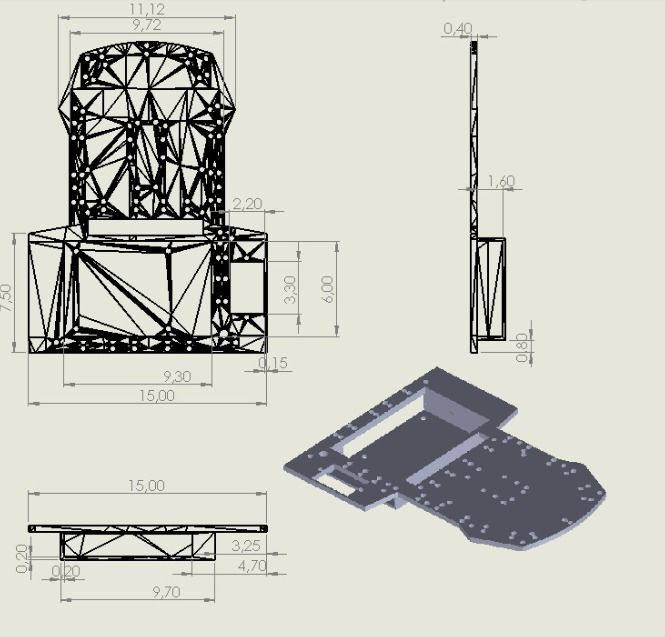
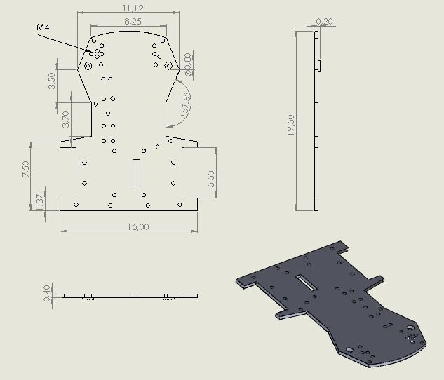

# 1. The  Chassis and General Design

We have a 2-platform design in our robot, which we preferred to be able to modify or repair the robot easily during our test and potentially the competition. It only takes our robot a few seconds to remove its top platform, and we can access the circuitry, sensors, and other internal mechanics so that we can work on them immediately. This saved us so much time when we were working on our robot.

The initial design for our chassis was very narrow with angled corners. Although it was sufficient enough for our initial testing, it was very unstable at higher speeds and tended to tip over easily when we added more parts to it. We first analyzed how our mass is distributed and where our center of gravity is, then we decided to completely revamp our design and resize our chassis to `15cm` in width and `28cm` in length. After the modifications, we were able to increase the stability of our robot so that our sensors, which include the camera and LIDAR, are protected from damage caused by vibrations.

We printed the 3D parts with PLA and the Sidewinder X2, along with a nozzle temperature of `210°C` and a heated bed temperature of `60°C`. Where we felt we needed additional strength, for example, in our shafts and our link rods, we chose to work with aluminum. Additionally, the robot weighs `1400g`.

The earlier versions of robots did not support complex steering or mounting points for sensors and other factors, but with the new design, it has become more modular, and ready for the Ackermann steering mechanism.

<table align="center" cellspacing="0" cellpadding="0" style="margin:0; padding:0; border-collapse:collapse;">
  <tr>
    <th colspan="4">Chassis Mechanical Drawings</th>
  </tr>
  <tr>
    <td align="center" colspan="2">
       
      <b>Top Chassis</b>
    </td>
    <td align="center" colspan="2">
       
      <b>Bottom Chassis</b>
    </td>
  </tr>
</table>

# 2. Drive System and Gearbox

We use a `12V` DC motor as our drive motor for our robot. It draws about `320mA` on average with no load and revolves at a speed of up to `450RPM` and although our robot weighs `1400g`, if we rely on this motor directly, it may result in insufficient torque for our robot to glide smoothly, especially when our robot accelerates. Because of this, we decided to create a gearbox to possess a ratio of `2:3` using our 3D printer. Below is the formula for the torque gained from this ratio:

$$\large T_{\text{output}} = T_{\text{motor}} \times \frac{3}{2}$$

The power generated from the motor is transmitted to the central gear and then to the other two wheels in the rear part of the vehicle. We also modeled the gearbox to work similarly to how a differential works. This means that when one wheel stops revolving, for example, when it hits something or meets more friction, the other can continue revolving. This way we make sure that it does not get stuck or lose its pace.

We printed the gears themselves and the gearbox with the PLA material, with aluminum shafts on which the gears are mounted. We also placed metal ball bearings on every rotating shaft, including rear wheels and gearbox connections, for our robot to work smoothly, instead of causing excessive wear to our gears to decrease friction. The metal ball bearings are 693ZZ.