# 1. The  Chassis and General Design

We have a 2-platform design in our robot, which we preferred to be able to modify or repair the robot easily during our test and potentially the competition. It only takes our robot a few seconds to remove its top platform, and we can access the circuitry, sensors, and other internal mechanics so that we can work on them immediately. This saved us so much time when we were working on our robot.

The initial design for our chassis was very narrow with angled corners. Although it was sufficient enough for our initial testing, it was very unstable at higher speeds and tended to tip over easily when we added more parts to it. We first analyzed how our mass is distributed and where our center of gravity is, then we decided to completely revamp our design and resize our chassis to `15cm` in width and `28cm` in length. After the modifications, we were able to increase the stability of our robot so that our sensors, which include the camera and LIDAR, are protected from damage caused by vibrations.

We printed the 3D parts with PLA and the Sidewinder X2, along with a nozzle temperature of `210°C` and a heated bed temperature of `60°C`. Where we felt we needed additional strength, for example, in our shafts and our link rods, we chose to work with aluminum. Additionally, the robot weighs `1400g`.

The earlier versions of robots did not support complex steering or mounting points for sensors and other factors, but with the new design, it has become more modular, and ready for the Ackermann steering mechanism.

<table align="center" cellspacing="0" cellpadding="0" style="margin:0; padding:0; border-collapse:collapse;">
  <tr>
    <th colspan="4">Chassis Mechanical Drawings</th>
  </tr>
  <tr>
    <td align="center" colspan="2">
      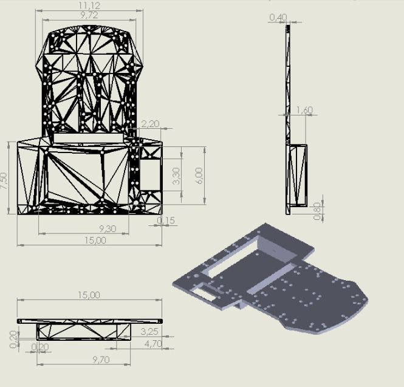 
      <b>Top Chassis</b>
    </td>
    <td align="center" colspan="2">
      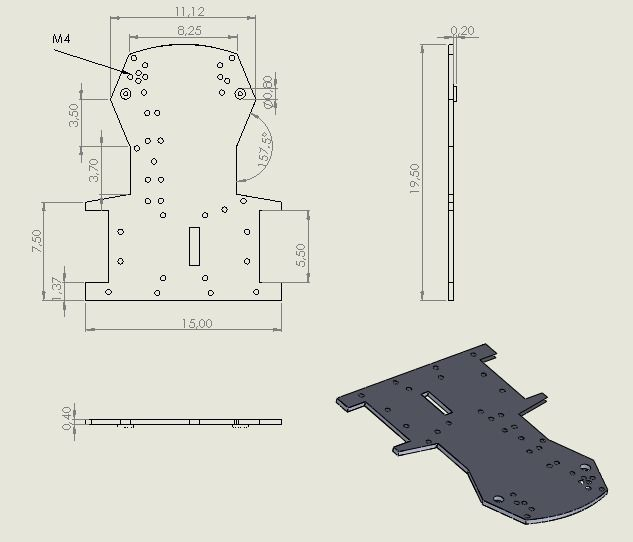 
      <b>Bottom Chassis</b>
    </td>
  </tr>
</table>

# 2. Drive System and Gearbox

We use a `12V` DC motor as our drive motor for our robot. It draws about `320mA` on average with no load and revolves at a speed of up to `450RPM` and although our robot weighs `1400g`, if we rely on this motor directly, it may result in insufficient torque for our robot to glide smoothly, especially when our robot accelerates. Because of this, we decided to create a gearbox to possess a ratio of `2:3` using our 3D printer. Below is the formula for the torque gained from this ratio:

$$\large T_{\text{output}} = T_{\text{motor}} \times \frac{3}{2}$$

The power generated from the motor is transmitted to the central gear and then to the other two wheels in the rear part of the vehicle. We also modeled the gearbox to work similarly to how a differential works. This means that when one wheel stops revolving, for example, when it hits something or meets more friction, the other can continue revolving. This way we make sure that it does not get stuck or lose its pace.

We printed the gears themselves and the gearbox with the PLA material, with aluminum shafts on which the gears are mounted. We also placed metal ball bearings on every rotating shaft, including rear wheels and gearbox connections, for our robot to work smoothly, instead of causing excessive wear to our gears to decrease friction. The metal ball bearings are 693ZZ.

<table align="center" cellspacing="0" cellpadding="0" style="margin:0; padding:0; border-collapse:collapse;">
  <tr>
    <th colspan="4">Gearbox Mechanical Drawings</th>
  </tr>
  <tr>
    <td align="center" colspan="2">
      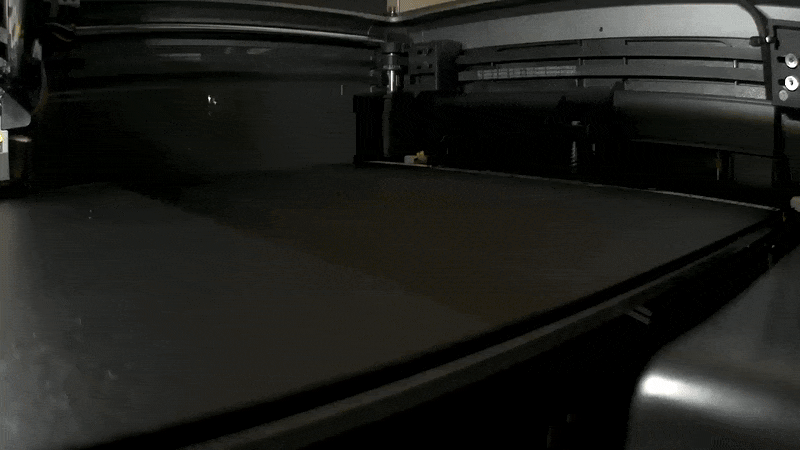 
      <b>Printing Proccess</b>
    </td>
    <td align="center" colspan="2">
      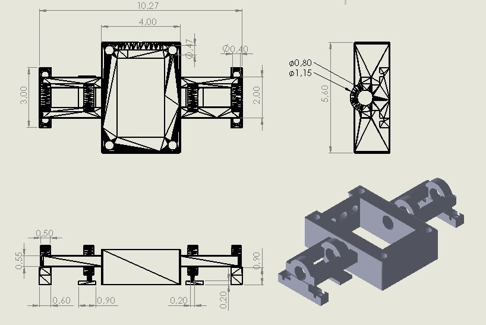 
      <b>Gearbox</b>
    </td>
  </tr>
</table>

# 3. Ackermann Steering System

One of the most important changes that we integrated into our design is the Ackermann steering system. We didn’t use this mechanism in our previous versions of the robots, where we could only manage to implement either turning mechanisms with semi-fixed angles and less accurate steering mechanisms. After we saw the difficulties that the previous systems were causing, wedecided to design the entire steering mechanism from scratch.
The principle behind Ackermann steering is that for a turn, the inner wheel has to turn at a sharper angle than the outer wheel. This corresponds to the geometric shape described by circular motion, where each wheel essentially has to turn at a slightly different radius than the other. After we applied the Ackermann principle, we were finally able to ensure that no wheels start to slide and that the robot moves in predictable arcs.

The formula for the relationship between steering angle is:

$$\large \frac{\tan(\theta_\text{inner})}{\tan(\theta_\text{outer})} = \frac{L}{L + T}$$

L is wheelbase and T is track width. The correct formula using turning radius is:

$$\large \frac{1}{\tan(\theta_\text{inner})} = \frac{1}{R} - \frac{D}{2H} \quad \large ; \quad \large \frac{1}{\tan(\theta_\text{outer})} = \frac{1}{R} + \frac{D}{2H}$$

Our front wheel distance is 13 cm, and our wheelbase (distance between our front and rear axle) is 11 cm. As I’ve already mentioned, the measurements were all established according to the Ackermann mechanism, which ensure that both wheels turn at angles and are still in sync.

In our steering system we used aluminum link arms that are mounted to 3D-printed steering knuckles and a PLA servo mount. We coupled the link arms with 3-mm aluminum rods, and all pivot points are equipped with 693ZZ bearings to ensure uniform movement. The steering power comes from a TD8120MG metal-gear servo. The servo acts on one link arm, and its action is transmitted through the Ackermann design to turn the wheels by the right amount. This way we make sure that our robot has a smooth turning action.

It is also important to notice and emphazie that the Ackermann steering is implemented in actual vehicles as well, to reduce wear on tires, enhance turning precision, and provide better control at both high and low velocities. For us, its implementation in our robot allowed our vehicle to act similarly to actual vehicles and enhance the turning precision in our navigation significantly.

<table align="center" cellspacing="0" cellpadding="0" style="margin:0; padding:0; border-collapse:collapse;">
  <tr>
    <th colspan="4">Servo Holder Mechanical Design</th>
  </tr>
  <tr>
    <td align="center" colspan="2">
       
      <b>Printing Proccess</b>
    </td>
    <td align="center" colspan="2">
       
      <b>Servo Holder</b>
    </td>
  </tr>
</table>

<table align="center" cellspacing="0" cellpadding="0" style="margin:0; padding:0; border-collapse:collapse;">
  <tr>
    <th colspan="4">Ackermann Wheel Holder Mechanical Design</th>
  </tr>
  <tr>
    <td align="center" colspan="2">
       
      <b>Printing Proccess</b>
    </td>
    <td align="center" colspan="2">
      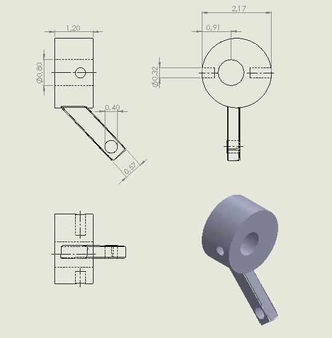 
      <b>Servo Holder</b>
    </td>
  </tr>
</table>

  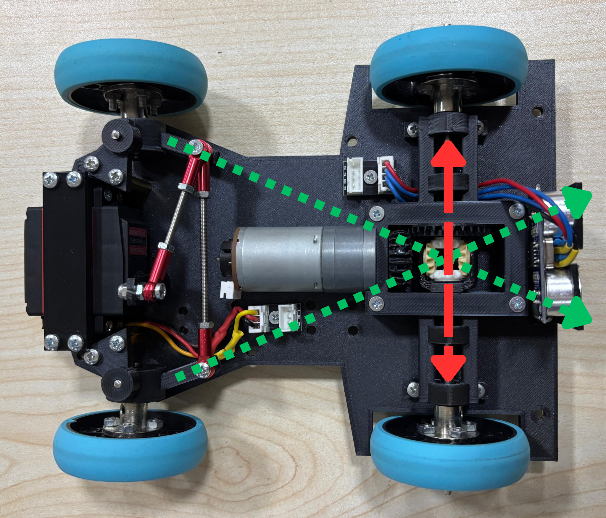
  
<i>Figure 1.1: Ackermann System</i>

>[!NOTE]
>The dotted lines here represent the imaginary projection of a straight line aligned perfectly with the tire holders. The intersection point of these lines should align to the center of the track perfectly for a functional ackermann system. In our previous robot we had miscalculated it a little bit, and the intersection point was a little bit away from the track. That's why this time we focused on fixing the problem. An accurate ackermann system provides us better steering possibilities.

# 4. Servo System

The servo that controls the steering mechanism is TD8120MG metal gear servo. It has a torque of 9.24 kg-cm at 4.8 volts and 10.63 kg-cm at 6 volts, which is ideal for the rotation of the wheels.. The servo also requires only 0.9 seconds to rotate 360 degrees, so it enables fast steering.

We placed the servo on top of a bracket created using PLA, and we specifically designed this bracket to make sure that it aligns well with the Ackermann linkage mechanism. As the servo rotates, it acts on the main steering arm, which in turn acts on both front wheels using the Ackermann rods.

  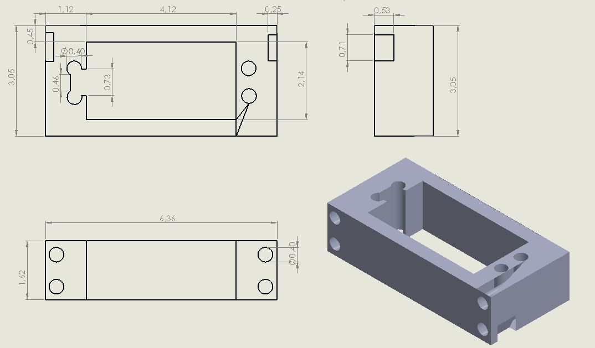
  
<i>Figure 1.2: Servo Holder</i>

# 5. Wheel Movement
We control the movement of the wheels on our robot with the rear DC motor. As the rear wheels rotate clockwise, they propel the robot forward, while the rotation of the motor in an anticlockwise direction makes the robot go backward. With the gearbox on the robot we are able to ensure that if one wheel faces a rotation problem or a mechanical barrier in general, the other wheel continues to rotate.

# 6. Center of Gravity and Weight Distribution
We also positioned every element on our robot to ensure its center of mass remains near the center. Liked this, we increase the robot’s balance and make sure it doesn't develop nose or tail lift during acceleration or braking. We placed The LIDAR near to the front but slightly above the center because we wanted to provide our robot with a full scan range. The camera sensor is placed on its 75-degree width-wise PLA bracket to allow it to scan most of its environment and identify objects-the colors-effectively. Lastly, at the back, we mounted the ultrasonic sensor to assist our robot in detecting objects while reversing or turning through its track on the map.

In the middle of the bottom platform, we put the battery that helps balance out the heavier parts on top, such as the Raspberry Pi and motor driver. We placed the components in this particular way because we wanted our vehicle to have very stable movement when driving, especially during higher speeds while turning.

The formula of the center of mass is:

$$\large X_\text{cm} = \frac{\sum_{i=1}^{n} x_i \times m_i}{\sum_{i=1}^{n} m_i} \quad \large ; \quad Y_\text{cm} = \frac{\sum_{i=1}^{n} y_i \times m_i}{\sum_{i=1}^{n} m_i} \quad \large ; \quad Z_\text{cm} = \frac{\sum_{i=1}^{n} z_i \times m_i}{\sum_{i=1}^{n} m_i}$$

This helped us create a well-rounded robot that moves in a predictable manner and doesn't tip.

<table align="center" cellspacing="0" cellpadding="0" style="margin:0; padding:0; border-collapse:collapse;">
  <tr>
    <th colspan="4">Chassis Mechanical Drawings</th>
  </tr>
  <tr>
    <td align="center" colspan="2">
      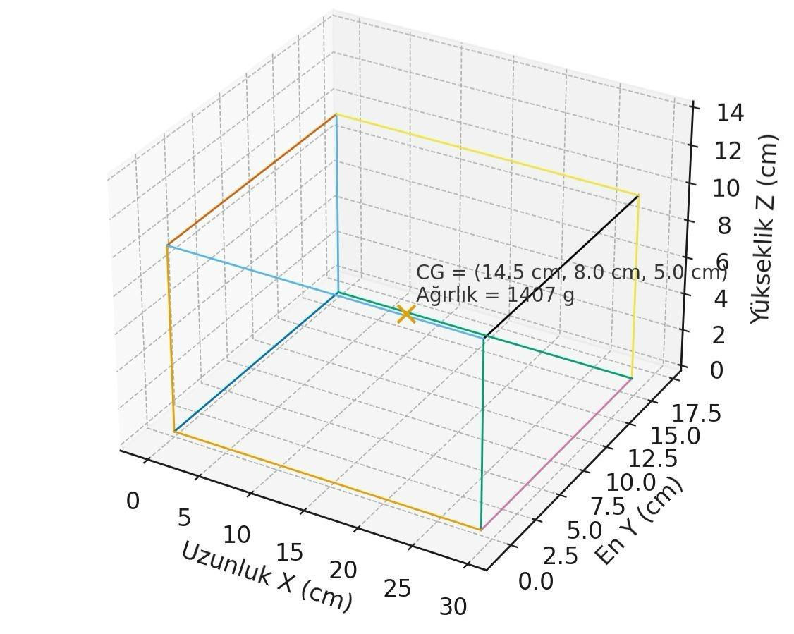 
      <b>Mass Diagram 3D</b>
    </td>
    <td align="center" colspan="2">
      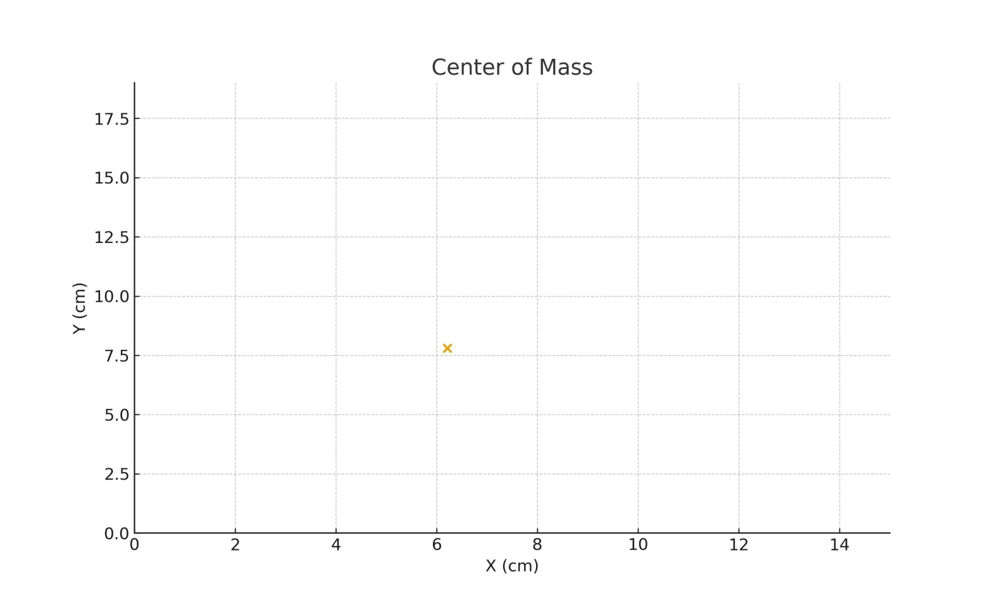 
      <b>Mass Diagram 2D</b>
    </td>
  </tr>
</table>

# 7. Cable Management

We organized every cable on our robot,  using PLA holders. We used them solely for this function, ensuring that we segregate the power cables, data cables, and servo cables so they are free from any interaction with electromagnetic interference, which can potentially lead to erratic behaviors or data from our sensor or servo. You can also see in our design that our cables are secured to prevent them from shifting whenever our robot moves.

# 8. Mechanical Materials and Bearings

We preferred to work with PLA for 3D parts because it is light and has easy printing properties. In parts that needed higher strength such as shafts, rods, or arms in linkages, we chose to work with aluminum because it resists deformation under stress but still is light.

For all turning joints, we used 693ZZ metal ball bearings. Metal ball bearings serve to reduce friction and vibration within the drivetrain, turning pivots, and wheel axles. We mounted bearings on the gearbox and front steering pivots to provide smooth motion and enhance mechanical robustness.

# 9. Sensor and Component Placement

We placed the LIDAR is placed at the front for it to scan freely from its environment. Coming to the front-mounted camera, we positioned it upwards for better visibility. The ultrasonic sensor in the back gives data on the distance behind it, which is really helpful for us during sharp movements and reversing functions in initial tests. On top are the Raspberry Pi 5 and motor driver, as connectivity is kind of easier there, on the top platform. We placed the battery to make sure that the center of the mass still remains as we intended it to be. The servo stays on the left side and is directly joined with the main steering arm so it can effectively steer the Ackerman linkages.

# 10. Specifications for 3D Printing 
We used the 3D printer Sidewinder X2 for both replicas and original parts. Because we use PLA, prints are a lot more accurate, with very low warpage. The nozzle temperature is at `210°C` and the hot plate temperature is at `60°C` which provides better bonding. Furhtermore, we created time-lapse videos to basically show how each part is being created so that we would be able to evaluate and, if needed, enhance the mechanical aspects of the robot.

# 11. Exploded View and SolidWorks Assembly

We created an exploded view assembly diagram using SolidWorks to detail and better show the development of our robot. We also have an exploded view diagram to show how parts relate to each other in an assembly. We really focused on creating the exploded view to develop the assemblies and the overall robot structure to be certain that the designed mechanism is really going to work in real life. This way, we made sure that every element of our robotic design was correctly integrated before 3D printing, making us avoid prototype failures.  Moreover, we thoroughly discussed on which 3D modelling tool to use and concluded that, in comparison to other 3D modeling software, SolidWorks provides better capabilities for working with mechanical assemblies, like interference detection and assembly simulations. As you can see, we showed how each part, layers for the chassis, Ackermann steering, gears, sensors, and electronics, combines into a full assembly. 

  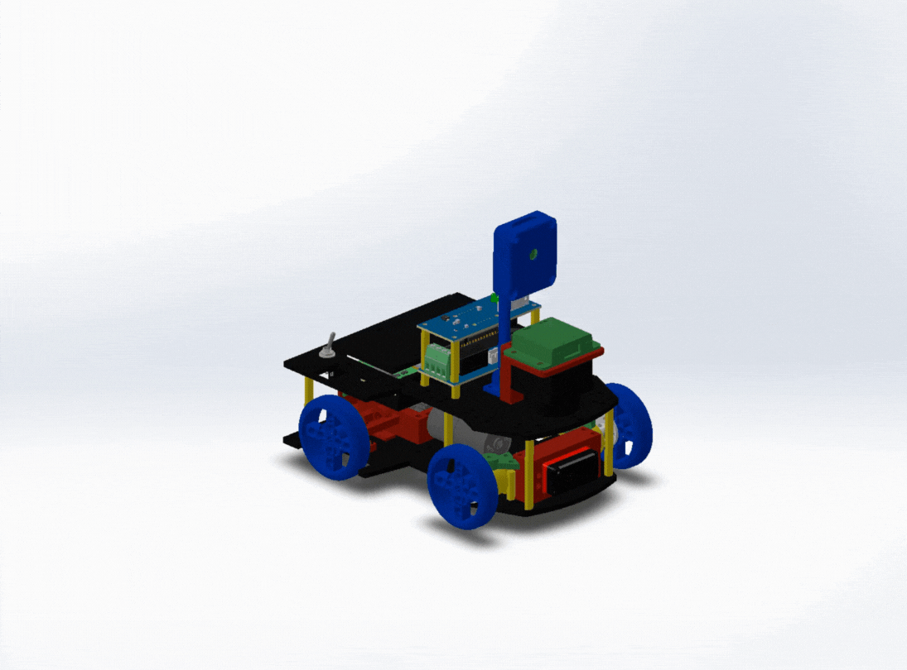
  
<i>Figure 1.5: Exploded View</i>

  <picture>
  <source media="(prefers-color-scheme: dark)" srcset="../media/my_image.png">
  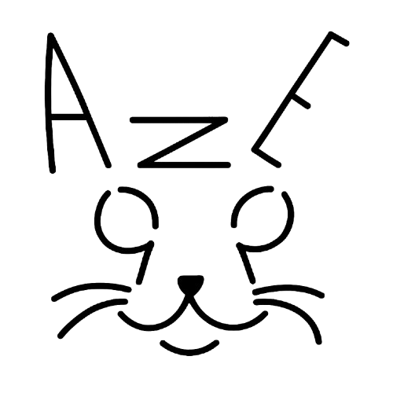
  </picture>

