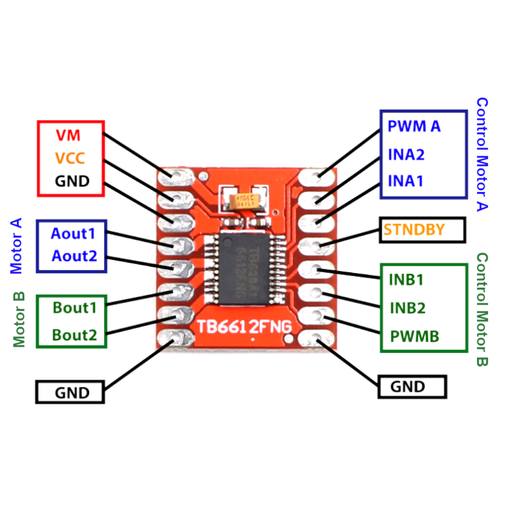

# 1. Bill of Materials (BOM)

<table>
  <tr>
    <th colspan="4">Electronics</th>
  </tr>

  <tr>
    <th>Component</th><th>Picture</th>
    <th>Component</th><th>Picture</th>
  </tr>

  <tr>
    <td>Raspberry Pi 5 x 1</td><td></td>
    <td>Motor Driver x 1</td><td></td>
  </tr>

  <tr>
    <td>T-MINI-Plus Lidar TOF</td><td></td>
    <td>BNO085 x 1</td><td></td>
  </tr>

  <tr>
    <td>3s Li-Po x 1</td><td></td>
    <td>IMAX B6AC battery charger x 1</td><td></td>
  </tr>

  <tr>
    <td>Servo Motor TD8120MG x 1</td><td></td>
    <td>Raspberry Pi Camera Module 3 x 1</td><td></td>
  </tr>

  <tr>
    <td>Encoder motor x 1</td><td></td>
    <td>Switch ON-OFF x 1</td><td></td>
  </tr>

  <tr>
    <td>2,54 mm JST-XH Connector Male x 5</td><td></td>
    <td>2,54 mm JST-XH Connector Female x 5</td><td></td>
  </tr>

  <tr>
    <td>XT-60 x 1</td><td></td>
    <td>2.54 mm Pin Header x 1</td><td></td>
  </tr>

  <tr>
    <td>Fuse x 1</td><td></td>
    <td>10K ohm resistor x 1</td><td></td>
  </tr>

  <tr>
    <td>330ohm resistor x 2</td><td></td>
    <td>GPIO cable x 1</td><td></td>
  </tr>

  <tr>
    <td>Li-Po Battery Test Device Amper Monitor x 1</td><td></td>
    <td>Type-c - Type-c Kabel x 1</td><td></td>
  </tr>

  <tr>
    <td>32 GB Storage Card x 1</td><td></td>
    <td>Heat sink x 1</td><td></td>
  </tr>

  <tr>
    <td>HCSR-04 x 1</td><td></td>
  </tr>
</table>

# 2. System Overview

### 2.1 Electronic System Architecture

**Raspberry Pi 5 (Main Controller):** The central processing unit
running the ROS-based software. It collects data from all sensors and
generates motor and servo commands.

**Raspberry Pi Pico 2 (Motor Controller):** Controls the encoder motor
and servo motor. It converts commands from the Raspberry Pi into
motor/servo movements and sends feedback data back to the Pi.

**Encoder DC Motor:** Provides forward and backward motion. Through the
encoder, it sends speed and position feedback to the Raspberry Pi via
the Motor Controller.

**Servo Motor:** Handles robot turns, with the servo angle controlled
via the motor controller.

2.2 Block Diagram:

# 3. Hardware and Component Introduction

### 3.1 Raspberry Pi 5

#### 3.1.1 Description and Features

<table style="width:80%; border-collapse:collapse;">
  <tr>
    <th colspan="3">Raspberry Pi 5</th>
  </tr>
  <tr>
    <td rowspan="3" style="width:400; text-align:center; vertical-align:middle; padding:0; margin:0;">
    

      
      
<i>Figure 1.1: Raspberry Pi 5</i>

    

    </td>
    <td>USB</td>
    <td>Raspberry Pi Pico 2W and T-MINI-PLUS Lidar sensor</td>
  </tr>
  <tr>
    <td>CSI Camera Port</td>
    <td>Connects to Camera Module 3</td>
  </tr>
  <tr>
    <td>GPIO Pins</td>
    <td>Start button, imu, ultrasonic, leds and buzzer</td>
  </tr>
  <tr>
    <td colspan="3">Quad-core CPU, 64-bit @ 2.4 GHz, 8 GB RAM</td>
  </tr>
  <tr>
    <td colspan="3">2 × USB 3.0, 2 × USB 2.0 ports</td>
  </tr>
  <tr>
    <td colspan="3">40-pin GPIO header</td>
  </tr>
  <tr>
    <td colspan="3">USB-C power input 5V/5A</td>
  </tr>
  <tr>
    <td colspan="3">Powered by Li-Po 3S 1300 mAh battery</td>
  </tr>
</table>

Raspberry Pi 5 is a high-performance single-board computer used as
the main controller of the robot. Its purpose in our robot is:
- Gather lidar, camera, gyro, and encoder data. All of our sensors are connected to Raspberry Pi.
- Proccess the data gathered and make decisions. It could be some kind of a brain, if sensors could be considered as the sense organs.
- Send the decisions made to Raspberry Pi Pico. Raspberry Pi is connected to Raspberry Pi Pico via USB. More information about these kind of connections could be found in `3.7.9. Scheme 2`.

#### 3.1.2 Connections and Pin Configuration

  
  
<i>Figure 1.2: Raspberry Pi Pinout</i>

>[!NOTE]
>Refer to the Raspberry Pi 5 pinout for accurate connections. If you want to see connection diagram, you need to go to `3.7.9. Scheme 2`.

### 3.2 Raspberry Pi Pico 2W Control Board

#### 3.2.1 Description and Features

<table style="width:80%; border-collapse:collapse;">
  <tr>
    <th colspan="3">Raspberry Pi Pico 2 W</th>
  </tr>
  <tr>
    <td rowspan="3" style="width:400; text-align:center; vertical-align:middle; padding:0; margin:0;">
    

      
      
<i>Figure 2.1: Raspberry Pi Pico 2 W</i>

    

    </td>
    <td>Wireless Connectivity</td>
    <td>2.4 GHz Wi-Fi</td>
  </tr>
  <tr>
    <td>Communication Interfaces</td>
    <td>USB, UART, I²C, SPI, PWM, ADC</td>
  </tr>
  <tr>
    <td>GPIO Pins</td>
    <td>26 multifunctional pins</td>
  </tr>
  <tr>
    <td colspan="3">RP2350 microcontroller, Dual-core ARM (up to 150 MHz)</td>
  </tr>
  <tr>
    <td colspan="3">USB 5 V input, regulated 3.3 V output (maximum 300 mA)</td>
  </tr>
  <tr>
    <td colspan="3">520 KB SRAM, 4 MB Flash</td>
  </tr>
</table>

**Raspberry Pi Pico 2W** is a compact and efficient microcontroller board designed for real-time embedded control, IoT, and robotic applications. It features a dual-core ARM Cortex-M0+ processor, integrated Wi-Fi connectivity, and flexible GPIO pins supporting multiple communication and control interfaces. Its purpose in our robot is:
- Read encoder sensor and send them to Raspberry Pi. Encoder sensors are connected to Raspberry Pi Pico. More information on this could be found in `3.7.9. Scheme 2`.
- Read motor command values from Raspberry Pi and send them to motor driver. Motor drivers are connected to Raspberry Pi Pico but the decisions are made in Raspberry Pi. That's why Raspberry Pi Pico should read the decisions from the Raspberry Pi.

#### 3.2.2 Connections and Pin Configuration

  
  
<i>Figure 2.2: Raspberry Pi Pico 2 Pinout</i>

>[!NOTE]
>Refer to the Raspberry Pi Pico 2W pinout for accurate connections.  If you want to see connection diagram, you need to go to `3.7.9. Scheme 2`.

### 3.3 TB6612FNG Control Board

#### 3.3.1 Description and Features

<table style="width:80%; border-collapse:collapse;">
  <tr>
    <th colspan="3">TB6612FNG</th>
  </tr>
  <tr>
    <td rowspan="3" style="height:300px; text-align:center; vertical-align:middle; padding:0; margin:0;">
    

      
      
<i>Figure 3.1: TB6612FNG</i>

    

    </td>
    <td>Operating voltage</td>
    <td>2.5V – 13.5V</td>
  </tr>
  <tr>
    <td>Continuous output current</td>
    <td>1.2A per channel (peak up to 3.2A)</td>
  </tr>
  <tr>
    <td>Logic voltage</td>
    <td>2.7V – 5.5V</td>
  </tr>
  <tr>
    <td colspan="3">Dual H-Bridge motor driver (can control 2 DC motors)</td>
  </tr>
  <tr>
    <td colspan="3">PWM control supported (up to 100 kHz)</td>
  </tr>
</table>

#### 3.3.2 Connections and Pin Configuration

  
  
<i>Figure 3.2: TB6612FNG Pinout</i>

## 3.4 Motors and Servo Motor

### 3.4.1 Powering and Controlling

**DC Motor:**
- Connected to Raspberry Pi Pico 2W via encoder motor ports.
- Encoder feedback allows precise speed and position control.
- Controlled using PWM signals.

**Servo Motor:**
- Controlled via PWM from Raspberry Pi Pico 2W 

### 3.4.2 DC Gear Motors

#### 3.4.2.1 Description and Features

<table style="width:80%; border-collapse:collapse;">
  <tr>
    <th colspan="3">Gear Motor</th>
  </tr>
  <tr>
    <td rowspan="3" style="height:350px; text-align:center; vertical-align:middle; padding:0; margin:0;">
    

      
      
<i>Figure 4.1: Gear Motor</i>

    

    </td>
    <td>Operating voltage</td>
    <td>5–12V DC</td>
  </tr>
  <tr>
    <td>Rotation Speed</td>
    <td>450 RPM @ 12V</td>
  </tr>
  <tr>
    <td>Encoder Voltage</td>
    <td>3.3–5V DC</td>
  </tr>
  <tr>
    <td colspan="3">Cylindrical brushed DC gear motors, available in 5 variants (two 6V, three 12V) with wide gear ratios.</td>
  </tr>
  <tr>
    <td colspan="3">No-load Current: 200 mA, Rated Current: 300 mA, Stall Current: 800 mA</td>
  </tr>
</table>

This motor is very advantageous for us, because it also has a built in encoder sensor. We use this encoder sensor to move certain amount of distance. It comes especially handy when going a distance according to lidar decisions. For example:
- Let's say we need to move until robot's front distance is less than some amount (say `40 cm`).
- If we write a conditional and move until some lidar value is achieved we can overshoot. That is because of low lidar frequency (which is `~5-7 hz`, this means robot can move forwards without considering lidar for `~142-200 ms`).
- But if we use encoder values and let's say start with `70 cm` distance from the wall, we can command the robot to go `30 cm`. This conditional is not bound to frequency of any electronical component ans is upto `~15-20 hz`. Which means robot can miss only for `~50-66 ms` (which is less than half).

>[!IMPORTANT]
>Motors can operate above or below nominal voltage; high voltages
may reduce lifespan.

#### 3.4.2.2 Connections and Pin Configuration

  
  
<i>Figure 4.2: Gear Motor Pinout</i>

### 3.4.3 Servo Motor (TD8120MG):

#### 3.4.3.1 Description and Features

<table style="width:80%; border-collapse:collapse;">
  <tr>
    <th colspan="3">Servo Motor</th>
  </tr>
  <tr>
    <td rowspan="4" style="height:350px; text-align:center; vertical-align:middle; padding:0; margin:0;">
    

      
      
<i>Figure 5.1: Servo Motor</i>

    

    </td>
    <td>Rotation Angle</td>
    <td>0°–180°</td>
  </tr>
  <tr>
    <td>Speed</td>
    <td>0.13 s / 60° @ 6.0V</td>
  </tr>
  <tr>
    <td>Torque</td>
    <td>20 kg·cm @ 6.0V, 23 kg·cm @ 7.4V</td>
  </tr>
  <tr>
    <td>Operating Voltage</td>
    <td>4.8–8.4V</td>
  </tr>
  <tr>
    <td colspan="3">Digital control system, metal gearbox</td>
  </tr>
</table>

We are using this digital servo for our steering (using an Ackermann controller). We previously used an analog servo but we switched because of some reasons:
- Digital servos have more frequency. They accept commands with smaller delays than analog servos.
- They turn faster and more on point. While an analog servo slowly reaches some steering point digital servos change their direction almost instantly.
- Has a greater precision. In comparison to analog servos we observed higher precision on turns, almost all turns made between countless tries were the same.

#### 3.4.3.2 Connections and Pin Configuration

  
  
<i>Figure 5.2: Servo Pinout</i>

### 3.5 LiDAR Sensor

#### 3.5.1 Definition and Model Features

Yahboom T-mini Plus LiDAR is a 2D lidar used for simple obstacle detection. Its main advantage is that it utilizes Time-of-Flight (ToF) measurement technology to deliver fast and accurate distance data. With high sampling frequency and good-enough
ambient light resistance, it performs well for our strategy.

<table style="width:80%; border-collapse:collapse;">
  <tr>
    <th colspan="3">Yahboom T-mini Plus LiDAR</th>
  </tr>
  <tr>
    <td rowspan="4" style="height:370px; text-align:center; vertical-align:middle; padding:0; margin:0;">
    

      
      
<i>Figure 6.1: Yahboom T-mini Plus LiDAR</i>

    

    </td>
    <td>Measurement Range</td>
    <td>0.1 – 12 m (reflectivity-dependent)</td>
  </tr>
  <tr>
    <td>Scan Frequency</td>
    <td>1 – 10 Hz adjustable</td>
  </tr>
  <tr>
    <td>Sampling Rate</td>
    <td>up to 5000 samples/s</td>
  </tr>
  <tr>
    <td>Power requirements</td>
    <td>5V 300mA</td>
  </tr>
</table>

Lidar is used for scanning along the robot's Z-axis. It gives us output in (angle in radians, distance in meters) format. We convert it into (angle in degrees, distance in centimeters) format to make it easier for us to use the values and visualize it. In our robot lidar is used for: detecting the obstacles and finding the tilt of robot according to its surroundings. You can find more info about its usage in [Programming documentation](/src/).

## 3.6 Camera

We are using a camera for detecting colors. There is no other usage of camera in our robot, as we are detecting the obstacle without it (as mentioned before we are using the lidar).

### 3.6.1 Definition and Features

<table style="width:80%; border-collapse:collapse;">
  <tr>
    <th colspan="3">Camera Module 3</th>
  </tr>
  <tr>
    <td rowspan="3" style="height:370px; text-align:center; vertical-align:middle; padding:0; margin:0;">
    

      
      
<i>Figure 7.1: Camera Module </i>

    

    </td>
    <td>Resolution</td>
    <td>11.9 MP (4608 × 2592)</td>
  </tr>
  <tr>
    <td>Pixel Size</td>
    <td>1.4 μm × 1.4 μm</td>
  </tr>
  <tr>
    <td>Video Modes</td>
    <td>1080p50 / 720p100 / 480p120</td>
  </tr>
  <tr>
    <td colspan="3">Connects via CSI-2 camera port</td>
  </tr>
  <tr>
    <td colspan="3">Power is supplied directly from the Raspberry Pi board via CSI-2
  interface</td>
  </tr>
</table>

The reason why we selected this camera is that it supports HDR mode, phase-detection autofocus (PDAF) for fast focusing. This is the main take-point for us, as the resolution of the camera is not really different between similar models. We already use it in `1586 x 864` mode for lower system usage and faster proccess time.

### 3.7 Gyroscope Sensor

#### 3.7.1 Definition and Features

<table style="width:80%; border-collapse:collapse;">
  <tr>
    <th colspan="3">BNO085</th>
  </tr>
  <tr>
    <td rowspan="2" style="height:370px; text-align:center; vertical-align:middle; padding:0; margin:0;">
    

      
      
<i>Figure 8.1: BNO085</i>

    

    </td>
    <td>Orientation output</td>
    <td>Euler vector, up to 200 Hz</td>
  </tr>
  <tr>
    <td>Operating voltage</td>
    <td>3.3V typical 3.5mA</td>
  </tr>
</table>

Our gyro has a built-in fusion algorithm, which means it can in theory fuse accelerometer, magnotemeter and gyroscope. Despite all the advantages in theory, our IMU has a great drift over time. To fix this issue we implemented some algorithms and they are referenced in [Programming documentation](/src/).

### 3.8 Ultrasonic Sensor

#### 3.7.1 Definition and Features

<table style="width:80%; border-collapse:collapse;">
  <tr>
    <th colspan="3">HCSR04</th>
  </tr>
  <tr>
    <td rowspan="4" style="height:370px; text-align:center; vertical-align:middle; padding:0; margin:0;">
    

      
      
<i>Figure 9.1: HCSR04</i>

    

    </td>
    <td>Operating Voltage & Current</td>
    <td>5V DC, 15 mA</td>
  </tr>
  <tr>
    <td>Ranging Distance</td>
    <td>2 cm to 400 cm</td>
  </tr>
  <tr>
    <td>Ranging Distance</td>
    <td>2 cm to 400 cm</td>
  </tr>
  <tr>
    <td>Accuracy</td>
    <td>~3mm</td>
  </tr>
  <tr>
    <td colspan="3">Measuring Angle,<15∘ cone;</td>
  </tr>
  <tr>
    <td colspan="3">A whopping frequency of 40kHz</td>
  </tr>
</table>

Altough this sensor support `2cm-400cm` range in theory, in reality with Raspberry Pi the best we could achive is a `10cm-70cm` range. Despite the difference this range is enough for us.

As we anticipated, the main technical challenge with our ultrasonic sensor is the voltage mismatch: the HC-SR04 sensor outputs its signal at 5 Volt (5V) logic, but the Raspberry Pi's GPIO pins are strictly limited to 3.3V. Connecting them directly would risk damaging the Pi's processor.

To solve this issue we developed a solution: By using specific resistors (i.e 1kΩ and 2kΩ) on the sensor's ECHO output line, we have successfully stepped down the voltage from 5V to a safe level of approximately 3.3V. This setup guarantees that the Raspberry Pi is protected from overvoltage damage while still receiving an accurate, readable digital signal.

To know which resistors should be used, we took advantage of level-shifting formula:

$$V_{\text{out}} = V_{\text{in}} \times \frac{R_2}{R_1 + R_2} \implies 5\text{V} \times \frac{2\text{k}\Omega}{1\text{k}\Omega + 2\text{k}\Omega} \approx 3.33\text{V}$$

<table cellspacing="0" cellpadding="0" style="margin:0; padding:0; border-collapse:collapse;">
  <tr>
    <th colspan="2">Level Shifting</th>
  </tr>
  <tr>
    <td align="center" style="margin:0; padding:0;"> <i>Figure 9.2: Diagram to show how voltage is remapped</i></td>
    <td align="center"> <i>Figure 9.3: To show the electric circuit</i></td>
  </tr>
</table>

**3.7. Custom PCB Design**

#### **3.7.1. Function and Purpose**

This custom control board was designed as the main interface between the
Raspberry Pi 5 and peripheral components of the robotic system. It
integrates sensor connections, user interaction elements (LEDs, button,
buzzer), and power management components, ensuring organized and safe
communication between modules.

#### **3.7.2. Circuit Elements and Layer Structure**

The circuit is built on a **dual-layer PCB (printed cicuit board)** and
includes the following key components:

- **Two LEDs (red and green):** Used as status and warning indicators.

- **One buzzer:** Provides audible alerts.

- **One push button:** User input control.

- **One fuse:** Overcurrent protection.

- **One gyro sensor (BNO085 IMU):** Orientation and motion sensing.

- **One switch:** Power on/off control.

- **Raspberry Pi 5 GPIO connections:** For system control and
  communication.

- **One ultraconic sensor:** For measure distance.

- **Some capacitor:** For sudden surges.

- **One ferrit bead:** For EMI.

On the PCB, **power lines** are routed with thick copper wires, while
**signal lines** are routed with thinner wires to ensure current
handling capacity and minimize interference.

**Board 1:**

{width="3.313043525809274in"
height="1.4232655293088363in"}{width="3.1304352580927386in"
height="1.3434787839020121in"}

**Board 2:**

{width="3.212276902887139in"
height="1.3652176290463691in"}{width="3.058459098862642in"
height="1.321738845144357in"}

These boards name is "Raspberry Pi Distribution Board"

#### **3.7.3. Connection Points**

- **Power Input:** Operates with an external power supply of **6--14
  V**.

- **Raspberry Pi 5 GPIO:** Direct connections for LEDs, button, buzzer,
  and the sensor.

- **Sensor Connection:** The BNO085 IMU is connected via the **I²C
  interface (SCL, SDA)** to the Raspberry Pi 5.

- **Connectors:** JST and pin header connectors are used for both power
  and signal interfaces.

### **3.7.4 Electronic Design and PCB Implementation**

#### **3.7.5 Electronic Schematic Description*

The electronic schematic was designed using **EasyEDA**.  
It includes the following functional blocks:

- **Power Section:** Battery input (6--14 V), fuse protection, power
  switch, and monitoring connector.

- **Sensor Section:** BNO085 IMU connected to the Raspberry Pi 5 via the
  I²C interface (SDA, SCL).

- **Control Unit:** Raspberry Pi 5 serves as the central controller,
  managing input and output signals.

- **User Interaction Components:** Two LEDs (status indicators), one
  buzzer (alert), and one push button (input).

Each component is clearly assigned to its corresponding GPIO pins,
ensuring reliable communication and power delivery.

**3.7.6 Hardware Issues and Troubleshooting Process**

At the beginning, we were using the **Hiwonder RRC Lite Controller**. At
first glance, it appeared to be an ideal solution for our needs --- a
single board that could easily interface with the **Raspberry Pi**,
included a **buzzer**, **button**, **encoder motor driver**, and **servo
ports**, and seemed capable of handling all our system requirements.

However, as we started using it, we began experiencing **connection
losses** between the **Raspberry Pi 5** and the controller while the
robot was operating. Initially, we didn't pay much attention to it since
the disconnections were quite rare. But over time, the issue worsened
--- what started as a once-a-week problem eventually became **three to
four disconnections per day** during testing.

We investigated the possible causes. Our first assumption was **EMI
(Electromagnetic Interference)** since the data cable was routed close
to the motor. To address this, we added a **ferrite bead** to the cable,
but it didn't help. Then we suspected a **power issue**, so we separated
the power connection and supplied the **Raspberry Pi** from an external
**power bank** instead. Unfortunately, the problem persisted.

We also added **capacitors** to the power input and replaced the cables,
yet the **RRC Lite Controller** continued to malfunction. Eventually, we
decided to **design our own motor driver board** to ensure stable
operation.

{width="3.3301881014873143in"
height="1.7099234470691163in"}{width="3.036836176727909in"
height="1.594339457567804in"}

**OUR MOTOR DRIVER**

### 3.7.7 PCB Layer Structure and Design Rules

- The PCB design was implemented on a **two-layer FR4 board**,
  manufactured by **JLCPCB**.

- The **top layer** carries most of the signal traces, while the
  **bottom layer** mainly serves as a **ground plane** to ensure stable
  reference potential and reduce noise.

- **Thicker copper traces** were used for power distribution lines,
  while **thinner traces** were used for signal routing.

- Design rules followed JLCPCB's recommended minimum clearance, trace
  width, and via size specifications.

- The layout was optimized to **minimize electromagnetic interference
  (EMI)** between the IMU sensor and the power circuits.

- A solid ground plane helps reduce sensor noise and improve overall
  system stability.

### 3.7.8 Connectors and Component Placement

- **Connectors:** JST connectors and pin headers were used to allow easy
  connection of external modules such as the battery, button, and
  display.

- **Placement:**

  - The **Raspberry Pi 5 GPIO header** is positioned near the center for
    organized wiring and balanced routing.

  - **LEDs, buzzer, and button** are placed at the edge of the board for
    easy user access.

  - **Power input, fuse, and switch** are grouped together in a
    dedicated **power section**.

  - The **IMU sensor** is placed close to the GPIO pins to keep I²C
    lines short and reduce signal distortion.

- The two-layer layout also allows sensitive signal traces (such as I²C
  lines) to be routed over a continuous ground plane for improved noise
  shielding.

### 3.7.9 Manufacturing and Assembly Notes

- The PCB was fabricated by **JLCPCB** using **FR4 material (1.6 mm
  thickness, 1 oz copper)** with **green solder mask** and **white
  silkscreen**.

- The inclusion of **solder mask** and **silkscreen layers** simplified
  soldering and improved assembly accuracy.

- Assembly was performed manually, using **through-hole (THT)**
  components and a few **surface-mount (SMD)** parts.

- **Thicker traces** were used for power paths, while **narrower ones**
  were used for signal lines.

- Compared to the initial perfboard prototype, the final 2-layer PCB
  offers **greater durability, improved signal integrity, and a more
  professional appearance**.

> **3.7.10 GERBER Files**
>
> If you want to order PCB(Printed Circuit Board), download these
> **GERBER** files and follow the steps in the video.

| Raspberry Pi Distributon Board 1 |     |
|----------------------------------|-----|
| Raspberry Pi Distributon Board 2 |     |
| Motor Driver                     |     |

> **Note:** If you don\'t know how to order a PCB, click the link and
> watch the video.
>
> [video](https://www.youtube.com/watch?v=SGsfiHOE9Fk&t=466s)

## **3.8 Power Supply (3S Li-Po Battery)**

### **3.8.1 Battery Specifications (Voltage, Capacity, C Rating)**

The power source of the project is a **JetFire 3S Li-Po battery**,
specifically designed for high-current demanding applications such as
robotics, drones, and defense systems. Thanks to its high discharge rate
and reliable cell quality, it ensures stable and long-term operation.

**Technical Specifications:**

- Voltage: **11.1 V** (nominal)

- Capacity: **1300 mAh**

- Cells: **3S (3 cells in series)**

- Discharge Rate: **50C continuous / 100C peak (max 10s)**

- Weight: **110 g**

- Dimensions: **74 × 33 × 21 mm**

- Discharge Connector: **XT60 (black)**

- Charging Connector: **JST-XHR (white)**

### **3.8.2 Power Management Circuits (BMS, Charging Circuit)**

Li-Po batteries require safe charging and monitoring systems. A
**Battery Management System (BMS)** or balance charger must be used to:

- Monitor individual cell voltages,

- Prevent overcharging or deep discharge,

- Provide safe current limits during operation.

### **3.8.3 Connections and Connectors**

The battery is connected to the system using an **XT60 connector** for
power delivery and a **JST-XHR balance connector** for charging and
monitoring. Proper wiring and insulation are critical to ensure safe
operation and prevent short circuits.

### **3.8.4 How to Charge the Battery (with iMAX B6AC)**

The **JetFire 3S Li-Po battery** must be charged using a balance charger
such as the **iMAX B6AC** to ensure safe and efficient charging. The
iMAX B6AC allows monitoring of individual cell voltages and prevents
overcharging.

**Charging Procedure:**

1.  **Connection:**

    - Plug the **XT60 connector** into the charger's discharge port.

    - Connect the **JST-XHR balance connector** to the charger's balance
      port.

2.  **Charger Setup:**

    - Select **LiPo BALANCE CHARGE** mode.

    - Set the battery type to **LiPo** and cell count to **3S (11.1V)**.

    - Set the charging current to **1.3A** (equal to the battery's 1C
      rate).

3.  **Charging Process:**

    - Start the charging process and monitor the charger display.

    - Ensure that each cell voltage remains within the safe range
      (**3.7V -- 4.2V**).

4.  **Completion:**

    - Charging is complete when the total voltage reaches approximately
      **12.6V (4.2V per cell)**.

    - Disconnect the battery from the charger and store it safely.

**Safety Notes:**

- Never leave the battery unattended during charging.

- Do not exceed the recommended charging current.

- Always charge on a non-conductive, fireproof surface.

## **4. Power Distribution and Management**

### **4.1 Power Distribution Diagram**

The 11.1V 3S Li-Po battery supplies the entire system. Power is
distributed through a central board, separating high-current lines
(motors, drivers) and low-current lines (controllers, sensors) for
stability.

### **4.2 Voltage Regulators and Converters (5V, 3.3V, etc.)**

- **5V:** Raspberry Pi, LiDAR, camera.

- **3.3V:** IMU and low-power sensors.

- **11.1V Direct:** Motors and motor drivers.  
  Switching regulators are used for efficiency.

### **4.3 Battery Management System (BMS, Charging Control)**

The BMS protects the Li-Po battery from overcharge, overdischarge, short
circuit, and overheating. Charging is done with a balance charger (iMAX
B6AC) to ensure safe and balanced operation.

### **4.4 Protection Mechanisms (Fuse, Overcurrent Protection)**

Fuses, polyfuses, reverse polarity, and voltage monitoring circuits are
added to prevent system failures and protect sensitive electronics.

**Circuit Scheme:**

<table cellspacing="0" cellpadding="0" style="margin:0; padding:0; border-collapse:collapse;">
  <tr>
    <td style="margin:0; padding:0;"> </td>
    <td> </td>
  </tr>
  <tr>
    <td align="center">Raspberry Pi Distribution Board</td>
    <td align="center">Motor Driver</td>
  </tr>
</table>

**6. Motor and Sensor Control Electronics**

**6.1. Motor Driver Circuits (PWM Control, Speed Feedback)**

The robot uses an Motor Controller, which is a dedicated motor and servo
driver board. This controller takes commands from the Raspberry Pi and
translates them into movements for the encoder motor and servo motor.

PWM Control: The DC motors are controlled using PWM signals. The servo
motor is also controlled via PWM from the Motor Controller or a
microcontroller. The PWM signals for the DC motors are used to control
their speed.

Speed Feedback: The encoder DC motor provides forward and backward
motion, and its encoder sends speed and position feedback to the
Raspberry Pi via the Motor Controller.

**6.2. Sensor Interface Circuits (Filtering, Level Shifting)**

The sensors are connected to the Raspberry Pi and other components
through various interfaces and circuits.

Sensor Connections: The BNO085 IMU sensor is connected to the Raspberry
Pi 5 via the I²C interface.

Voltage Levels: The system uses voltage regulators and converters to
provide the correct voltage levels for different components. The
Raspberry Pi, LiDAR, and camera operate on 5V, while the IMU and other
low-power sensors use 3.3V.

Noise Reduction: The custom PCB design, implemented on a PCB, uses
thicker wires for power lines and thinner wires for signal lines to
ensure current handling and minimize interference. The ground lines were
also carefully routed to reduce noise in sensor readings.
