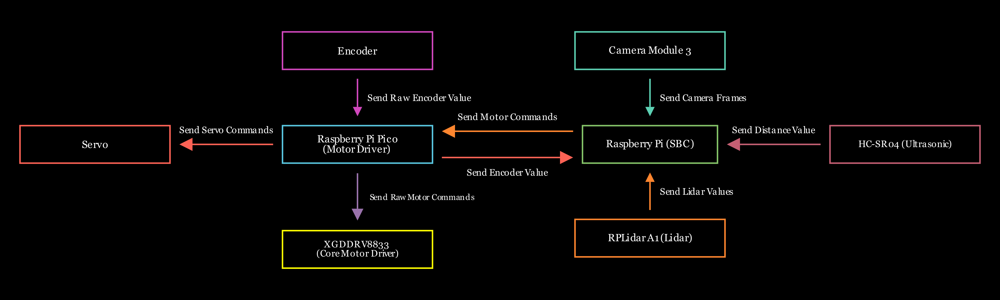
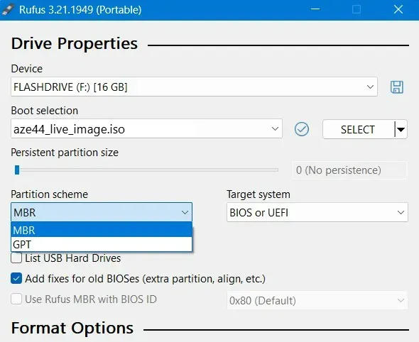

In this section of the documentation software solution of our strategy is discussed. Before starting to explain how our code works we would like to present our principles while creating the software:

1. **Keep it simple**: The computing power of our SBC and the accuracy of our sensors are limited. There is no point in designing an extra accurate algorithm, because it most probably would not work in practice mose of the time. Also maintaining a complex algorithmic structure is not easy and would require a lot of time, which we could more effectively spend on optimizing existing simpler algorithms or our strategy.

2. **Have a margin of error**: There is nothing such as "*at STP*" in the competition arena. So you can't just solely rely on robot's mechanic design and right perfect code. Software should always be able to tolerate some amount of hardware error. So should hardware, as perfection lies in balance of both.

3. **Test enough**: Sometimes we get new ideas for our strategy or overall robot behaviour. It is not appropriate to use it if it works once. Before moving on and accepting the solution, it should be tested. Many of the ideas look bright at first glance but with proper testing its faults are much more observable.
> [!NOTE]
> For every problem, there is a solution which is simple, fast, and wrong.

4. **Never be afraid of trying new ideas**: Most of our ideas about the robot and strategy has changed since we started working on the actual map. Almost nothing has stayed the same. Because of that, we always think of alternative ways of doing something in parallel to implementing our already existing ideas.

5. **Stay positive**: It is really easy to get pessimistic when a solution does not work, especially when you spend a lot of time on it. In times like these we remind ourselves why we started this journey. To learn something new, experience new stuff and compete fairly.

Now that we got our principles out of the way, we can start with the actual software. Our structure for software flow is such:

<div>
  
  <p style="margin-top:0;"><i>Figure 1.1 Software Flow Diagram</i></p>
</div>

Let's get into setting up the development environment. We have a very generic development environment for the host machine. The only programs you need to develop is `ssh` and any text editor of your choice. All of the modern machines nowadays come with these by default. To develop on the host machine we used `Command Prompt` in our Windows machine and `Terminal` in our Ubuntu machine.

Environment for the Raspberry Pi is a little bit more complex but to make it simpler we developed a solution as such:

[](https://your-download-link)

This is our Raspberry Pi image. If you flash this file into your Raspberry, you will get the exactly same environment as us. To flash this image you can use ``Rufus`` for Windows, ``UNetbootin`` for Linux or ``WonderISO`` for MacOS.

<div>
  
  <p style="margin-top:0;"><i>Figure 1.2: Rufus flashing tool</i></p>
</div>

But if you want to customize installation you should flush the Raspberry Pi from the official Raspberry Pi Imager. If not, just skip to the `Code and Strategy` section.

> [!IMPORTANT]
> To be able to execute the commands and instructions below you need a microSD card of at least `16GB` storage. The operating system for Raspberry Pi will be installed in this microSD card. If you have any important files in the microSD card, please back them up because after the installation they will be erased from the card.

We are using `Ubuntu Server 24.04.3 LTS (64-bit)` for our Raspberry Pi. You can install this OS to your microSD as you want, but the recommended way is to use the official [Raspberry PI Imager tool](https://www.raspberrypi.com/software/).

<div>
  
  <p style="margin-top:0;"><i>Figure 1.3: Raspberry Pi Imager</i></p>
</div>

After selection your Raspberry Pi model press "Choose OS". Afterwards select the `Other general-purpose OS` > `Ubuntu` > `Ubuntu Server 24.04.3 LTS (64-bit)` operating system.

<div>
  
  <p style="margin-top:0;"><i>Figure 1.4: Ubuntu Server 24.04.3 LTS (64-bit)</i></p>
</div>

> [!NOTE]
> `Ubuntu Server 24.04.3 LTS (64-bit)` is the latest release for Ubuntu Server. Despite this, it support many Raspberry Pi versions. Without the loss of generality, you do not need to install this specific version of Ubuntu to be able to execute the instructions and commands, but it is recommended as it is what we used.

> [!NOTE]
> It is not possible to use `Raspberry Pi OS (Raspbian)` for this project. The reason for that is `ROS2 JAZZY`, a dependency for this project, not being supported by `Raspbian`. There might be some workarounds to get it to work, but it would be a waste of time as `Ubuntu Server 24.04.3 LTS (64-bit)` is already as minimal as official `Raspbian`.

Now to configure the operating system press `Ctrl` `Shift` `X` or `⌘` `Shift` `X`. In the panel that opened, under the `General` tab set your internet settings and your credentials for Raspberry Pi user. After that switch to `Services` tab and enable `SSH` and `Password Authentication`. After doing all the configurations press `Next` and the installation will start.

After the installation is complete plug the microSD card into Raspberry Pi. After it boots, it is recommended to execute following commands:

```
$ sudo apt update
$ sudo apt upgrade
```

After installing the operating system you can install the ROS2 environment.

Start with installing `Git`. This package will be used for installing other packages from the internet:

```bash
$ sudo apt-get install git
```

To be able to use Raspberry Pi camera module, the packages `libcamera` and `rpicam-apps` should be installed. Start with installing the dependencies:

```bash
$ sudo apt install -y libboost-dev
$ sudo apt install -y libgnutls28-dev openssl libtiff5-dev pybind11-dev
$ sudo apt install -y meson cmake
$ sudo apt install -y python3-yaml python3-ply
$ sudo apt install -y libglib2.0-dev libgstreamer-plugins-base1.0-dev
```

And now to install the package:

```bash
$ git clone https://github.com/raspberrypi/libcamera.git
```

Go to the root directory:

```bash
$ cd libcamera
```

To configure the package build:

```bash
$ meson setup build --buildtype=release -Dpipelines=rpi/vc4,rpi/pisp -Dipas=rpi/vc4,rpi/pisp -Dv4l2=true -Dgstreamer=enabled -Dtest=false -Dlc-compliance=disabled -Dcam=disabled -Dqcam=disabled -Ddocumentation=disabled -Dpycamera=enabled
```

And finally to install `libcamera` package:

```bash
$ sudo ninja -C build install
```

After installing `libcamera` package we can install `rpicam-apps`. Start with dependencies:

```bash
$ sudo apt install -y cmake libboost-program-options-dev libdrm-dev libexif-dev
$ sudo apt install -y meson ninja-build
```

Go to the root directory and download the package:

```bash
$ git clone https://github.com/raspberrypi/rpicam-apps.git
```

Move to the package directory:

```bash
$ cd rpicam-apps
```

Before doing the configuration install `libav` package to be able to record videos using the camera:

```bash
$ sudo apt install -y libavcodec-dev libavformat-dev libavutil-dev libswscale-dev libavdevice-dev libavfilter-dev
```

Now you can configure the build:

```bash
$ meson setup build -Denable_libav=enabled -Denable_drm=enabled -Denable_egl=disabled -Denable_qt=disabled -Denable_opencv=disabled -Denable_tflite=disabled -Denable_hailo=disabled
```

And finally install `rpicam-apps`:

```bash
$ meson compile -C build
$ sudo meson install -C build
```

You should end the installation with updating the `ldconfig cache`. This is handy for using the installed packages in other directories:

```bash
$ sudo ldconfig
```

Now that all the required packages are installed we can install `ROS2 Jazzy` integration.

[`ROS2 Jazzy`](https://docs.ros.org/en/jazzy/index.html) is a collection of robot integration packages. With the following instructions you should be able to get `ROS2 Jazzy` on your system.

Configure the locale for Raspberry Pi:

```bash
$ locale 
$ sudo apt update && sudo apt install locales
$ sudo locale-gen en_US en_US.UTF-8
$ sudo update-locale LC_ALL=en_US.UTF-8 LANG=en_US.UTF-8
$ export LANG=en_US.UTF-8
$ locale 
```

Add required repositories to the `apt` package manager to be able to install required apps:

```bash
$ sudo apt install software-properties-common
$ sudo add-apt-repository universe
```

Now add `ros2-apt-source` package:

```bash
$ sudo apt update && sudo apt install curl -y
$ export ROS_APT_SOURCE_VERSION=$(curl -s https://api.github.com/repos/ros-infrastructure/ros-apt-source/releases/latest | grep -F "tag_name" | awk -F\" '{print $4}')
$ curl -L -o /tmp/ros2-apt-source.deb "https://github.com/ros-infrastructure/ros-apt-source/releases/download/${ROS_APT_SOURCE_VERSION}/ros2-apt-source_${ROS_APT_SOURCE_VERSION}.$(. /etc/os-release && echo $VERSION_CODENAME)_all.deb" # If using Ubuntu derivates use $UBUNTU_CODENAME
$ sudo dpkg -i /tmp/ros2-apt-source.deb
```

To enable the programming environment:

```bash
$ sudo apt update && sudo apt install -y \
  python3-flake8-blind-except \
  python3-flake8-class-newline \
  python3-flake8-deprecated \
  python3-mypy \
  python3-pip \
  python3-pytest \
  python3-pytest-cov \
  python3-pytest-mock \
  python3-pytest-repeat \
  python3-pytest-rerunfailures \
  python3-pytest-runner \
  python3-pytest-timeout \
  ros-dev-tools
```

Now create a `ROS2 Jazzy` workspace and install required `ROS2 Jazzy` packages:

```bash
$ mkdir -p ~/ros2_jazzy/src
$ cd ~/ros2_jazzy
$ vcs import --input https://raw.githubusercontent.com/ros2/ros2/jazzy/ros2.repos src
```

To be confident that all the packages are up-to-date:

```bash
$ sudo apt upgrade
```

Finally install everything:

```bash
$ sudo rosdep init
$ rosdep update
$ rosdep install --from-paths src --ignore-src -y --skip-keys "fastcdr rti-connext-dds-6.0.1 urdfdom_headers"
```

After installing the `ROS2 Jazzy` system we can install required packages for the project.

Installing `ROS2 Jazzy` system is not enough to use it. You need to source `/opt/ros/jazzy/setup.bash` everytime you want to use it. If you don't want to explicitely do it everytime execute this command, which add the command to startup:

```bash
$ echo "source /opt/ros/jazzy/setup.bash">>~/.bashrc
```

After executing the command restart the console.

`camera_ros` is a package to integrate camera with `ROS2 Jazzy`. To install `camera_ros` execute the following commands:

```bash
$ cd ~/ros2_jazzy/src
$ sudo apt -y install python3-colcon-meson
$ git clone https://github.com/christianrauch/camera_ros.git
$ source /opt/ros/$ROS_DISTRO/setup.bash
$ cd ~/ros2_jazzy/
$ rosdep install -y --from-paths src --ignore-src --rosdistro $ROS_DISTRO --skip-keys=libcamera
$ colcon build --event-handlers=console_direct+
```

`rplidar_ros` is a package to use RPLidar system. To install it:

```bash
$ cd ~/ros2_jazzy/src
$ git clone https://github.com/Slamtec/rplidar_ros.git
$ rosdep install -y --from-paths src --ignore-src --rosdistro $ROS_DISTRO --skip-keys=libcamera
$ colcon build --symlink-install
```

To use the packages after installing them you should source `~/ros2_jazzy/install/setup.bash` everytime. If you don't want to add it to the `~/.bashrc`:

```bash
$ echo "source ~/ros2_jazzy/install/setup.bash">>~/.bashrc
```

From now on we will talk about different section of the software as described in figure 1.1.

Let's start with the Raspberry Pi Pico - motor driver. We have created our own API for motor and servo control which also supports motor encoders. Before developping our own motor driver we actually tried an already existing one, but it had many issues. The motor driver we used before was consistently losing connection with Raspberry Pi. It was stopping to receive any commands transmitted from the Raspberry Pi and executed the last one. We had many ideas to fix this issue:

1. **Sending large packets over USB**: Our idea for this happening was incorrect use of available transmission space inside the USB adapter. So we modified the API of our previous motor driver. This hypothesis was actually correct to some degree: before making the modification our robot lost connection at approximately `5th minute` of working, but after making the modification we actually quadrupled this number with `20 minutes` lifespan. But robot was still losing connection.

2. **Sending too much motor commands**: This was another hypothesis of ours, and to try it out we lowered the frequency of our Raspberry Pi solution. This actually helped a lot as now the lifespan of the motor driver was up to `40 minutes`. This was some improvement, but motor drivers are designed to work as much as they are powered, not periodically.

3. **Losing bytes when receiving the packets**: We had really good faith in this idea. Because we thought the issue was most probably this. But when we tried adding addition checksums and start flags to the packet for security, nothing changed at all. We did not observe any improvement in lifespan of the motor driver.

After having these issues we decided it was not worth risking a faulty motor driver. When we made this decision there was only a week left before the national qualifications so we were too late to buy a new motor driver. That's why we decided to make our own using Raspberry Pi Pico. Pico receives the commands from Raspberry Pi and sends them to the internat motor driver. When designing the work flow of our API we relied on our previous hypothesis of why a motor drive could fail. The new API we have created has never failed since we have created it and we hope it will stay so. Let's look at some cruicial parts and explain them on code:

```python
while True: # While Pico is alive
    position = encoder.position # Get current position
    if position != last_position: # If current position is not same as last position
        send_command(position) # We send new encoder value
        last_position = position # And update last position

    time.sleep(0.001) # Add a little delay
```

We are only sending when the encoder value changes. Because if we'd always send encoder value usb data storage would be extremely polluted by zeros, and it results in slip.

```python
def read_command():
    global buffer
    if usb_serial.in_waiting > 0:
        buffer += usb_serial.read(usb_serial.in_waiting) # Accumulate buffer globally
    while len(buffer) >= 3: # All packets are siz of 3
        frame = buffer[:3]
        servo_val = frame[0]
        motor_raw = frame[1]
        checksum = frame[2]
        if checksum == ((servo_val + motor_raw) & 0xFF): # If checksums match
            motor_val = motor_raw
            if motor_val >= 128: # Packets are unsigned but to give negative speeds
                motor_val -= 256 # we subtract 256 when speed is over 128.
            buffer = buffer[3:]  # This idea comes from how two's complement works.
            return servo_val, motor_val
        else:
            buffer = buffer[1:] # If checksums mismatch we shift by a byte.
    return None
```

We are securing the commands using checksums. When the checksums don't match we know there has been a byte lost. Despite we have this algorithm we have almost never observed a checksum mismatch.

```python
def send_command(value):
    data = value.to_bytes(4, 'big', signed=True)
    checksum = sum(data) & 0xFF # Value is checksummed
    if usb_serial.out_waiting < 64: # Send data if there is not much queue in usb storage
        usb_serial.write(data + bytes([checksum]))
```

Cruicial part about this function is limiting how much data is sent at any moment. We don't allow a queue of size more than `64 bytes`. This way usb does not get flooded. We actually did not have this logic at some point and we were losing connection between our motor driver.

```python
while True:
    cmd = read_command()
    if cmd is not None: # If there is an incomming command
        servo_angle, motor_speed = cmd
        set_angle(servo_angle)
        move_motor(motor_speed)

    position = encoder.position
    if position != last_position:
        send_command(position)
        last_position = position

    time.sleep(0.001)
```

This is the main loop of the API. As you can see transmitting encoder values and receiving commands happen concurrently. You can view this API further in `src/pico.py`.

There is also another API inside of the Raspberry Pi to communicate with Raspberry Pi Pico. API for Raspberry Pi is almost identical to this code, and you can view it in `src/robot_car.py`.

> [!NOTE]
> Our motor driver API support motor commands at a frequency up to `50 Hz`, and we are using it at `20 Hz`. The limit for our usage is bound by our strategy and the overall logic for the solution.

We would like to talk a little bit about how the robot goes straight. Gyro sensor is not reliable enough, and drifts very often. To fix this we have developed such a strategy: using lidar we get closest point on our left. Geometrically this point is always perpendicular to the robot if the robot is straight. Otherwise the angle between us and the point gives how tilted the robot is. You can inspect the illustration to see what is going on:

<div>
  
  <p style="margin-top:0;"><i>Figure 1.5: Straighten Strategy</i></p>
</div>

We have a very simple strategy for Open Challange. All we do is to go straight as much as we can, and when we get to close we make a turn. You can see the illustration to get a better idea:

<div>
  
  <p style="margin-top:0;"><i>Figure 1.6: Open Challange Strategy</i></p>
</div>